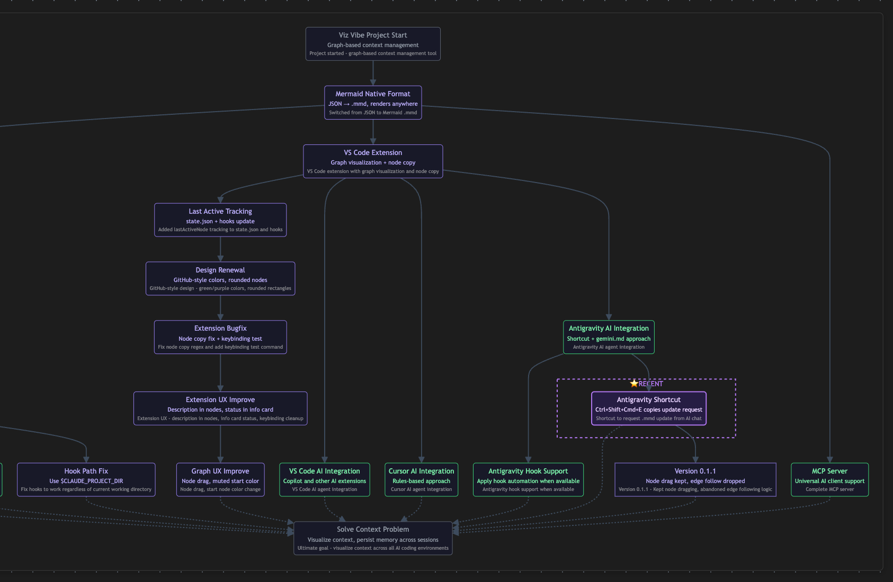
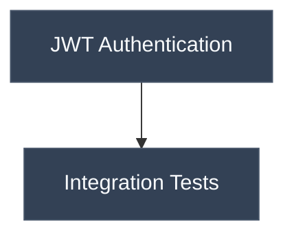

<div align="center">

# Viz-Vibe: Context Map Plugin for Vibe Coding

A graph-based navigator plugin to track your coding trajectory, issues, and TODO lists — all in one place. We make human-AI collaboration seamless by keeping coding context clear at a glance.

### 🔌 Works with your favorite vibe coding tools

**Cursor** • **Antigravity** • **VS Code** • **Claude Code** • **Open Code** • **oh-my-opencode** • **oh-my-claude** • **Codex CLI** • **Gemini CLI** • **Vibe Kanban** • and more!

<p align="center">
  <a href="#-getting-started">Getting Started</a> •
  <a href="#-features">Features</a> •
  <a href="#-installation">Installation</a> •
  <a href="#-ai-integration">AI Integration</a> •
  <a href="#contributing">Contributing</a>
</p>

<p align="center">
  
  
  
  
</p>

---

</div>



## 🚀 About

**Viz Vibe** is an open-source **plugin** that provides a **graph-structured trajectory** as an interface for collaboration between humans and AI.

> ⚡ **You don't need to read any documentation.** Your AI handles everything — from setup to daily management.

Whatever vibe coding tool you use, your AI will generate a `vizvibe.mmd` file in your project root. **You just review the result.**

The `vizvibe.mmd` file contains your project's graph — your trajectory, decisions, blockers, and TODOs. Your AI will manage this file alongside you, updating it as your project evolves.

**Our mission:** Make even the context file itself manageable through vibes. No manual editing, no learning curve — just seamless collaboration.

> ⚠️ **Note:** Viz Vibe does NOT visualize your repository's code structure or how your project works. Instead, it visualizes your **work trajectory** — what you've done, what's planned, your decisions, blockers, and the path of your coding journey as a graph.

---

## 💡 Why We Built This

As AI advances, it's becoming harder for humans to keep up with the context of their AI's work during vibe coding. The challenge is that someone — perhaps always humans — still needs to understand and manage what the AI is doing. That's why we started this project.

---

## 🚀 Getting Started

### For Claude Code Users

**1. Install Globally**

```bash
curl -fsSL https://raw.githubusercontent.com/NamHyeongKeol/viz-vibe/main/claude-code/install.sh | bash
```

<details>
<summary>What gets installed?</summary>

| Location      | Files                                                                                                                       |
| ------------- | --------------------------------------------------------------------------------------------------------------------------- |
| `~/.vizvibe/` | CLI (`bin/vizvibe`), browser viewer (`bin/vizvibe-server.js`), hook scripts, templates                                      |
| `~/.claude/`  | `hooks/read-vizvibe.js`, `hooks/update-vizvibe.js`, `hooks/VIZVIBE.md`, `skills/vizvibe/SKILL.md`, `settings.json` (merged) |

</details>

---

**2. Initialize Project**

```bash
cd your-project
vizvibe init
```

<details>
<summary>What gets created?</summary>

- `vizvibe.mmd` — Your trajectory graph file
- `.vizvibe-state.json` added to `.gitignore` — Runtime state (auto-generated)

</details>

---

**3. View in Browser**

```bash
vizvibe view
```

Opens at `http://localhost:5125`. Copy the setup prompt from the overlay.

---

**4. Start Claude Code**

```bash
claude
```

Paste: _"Please setup vizvibe for this project. Write the trajectory in my language."_

<details>
<summary>CLI Commands</summary>

| Command        | Description                 |
| -------------- | --------------------------- |
| `vizvibe init` | Initialize `vizvibe.mmd`    |
| `vizvibe view` | Open in browser (port 5125) |
| `vizvibe help` | Show help                   |

**Uninstall:**

```bash
curl -fsSL https://raw.githubusercontent.com/NamHyeongKeol/viz-vibe/main/claude-code/uninstall.sh | bash
```

</details>

---

### For VS Code Users

**Install the Extension:**

1. Open **VS Code Marketplace**: [Viz Vibe Extension](https://marketplace.visualstudio.com/items?itemName=viz-vibe.viz-vibe)
2. Click **Install**, or search "Viz Vibe" in the Extensions panel (`Cmd+Shift+X`)

**Setup:**

1. Run `Cmd+Shift+P` → **"Viz Vibe: Initialize Project"**
2. Open `vizvibe.mmd` to see the graph visualization

---

### For Cursor Users

**Install the Extension:**

1. Open **Open VSX Registry**: [Viz Vibe on Open VSX](https://open-vsx.org/extension/viz-vibe/viz-vibe)
2. Click **Install**, or search "Viz Vibe" in Cursor's Extensions panel

**Alternative: Install from VSIX**

1. Download the latest `.vsix` from [Releases](https://github.com/NamHyeongKeol/viz-vibe/releases)
2. `Cmd+Shift+P` → **"Extensions: Install from VSIX..."**
3. Select the downloaded file and reload

**Setup:**

1. Run `Cmd+Shift+P` → **"Viz Vibe: Initialize Project"**
2. Open `vizvibe.mmd` to see the graph visualization

---

### For Antigravity Users

**Install the Extension:**

1. Open **VS Code Marketplace**: [Viz Vibe Extension](https://marketplace.visualstudio.com/items?itemName=viz-vibe.viz-vibe)
2. Click **Install**, or search "Viz Vibe" in the Extensions panel (`Cmd+Shift+X`)

**Setup:**

1. Run `Cmd+Shift+P` → **"Viz Vibe: Initialize Project"**
2. Open `vizvibe.mmd` to see the graph visualization

> ⚠️ **Note:** Antigravity doesn't support hooks yet, so automatic `.mmd` updates are not available.

**Manual Updates:**

- Press **`Ctrl+Shift+Cmd+E`** to copy an update request to clipboard, then paste it into the chat
- Or simply ask: _"Please update vizvibe.mmd with what we've done"_

The extension automatically updates `~/.gemini/GEMINI.md` during initialization, so the AI already knows how to manage the trajectory!

---

## ✨ Features

- 🔗 **Graph-based Context** — Visualize your coding journey as interconnected nodes
- 🤝 **Human-AI Collaboration** — Track decisions, blockers, and progress together
- 📊 **Mermaid Native** — Uses standard Mermaid syntax, viewable anywhere (GitHub, Notion, etc.)
- 🔄 **Auto-Update** — Trajectory updates automatically after AI responses (Claude Code)
- 📁 **`.mmd` File Format** — Human-readable, AI-editable Mermaid flowcharts
- 🤖 **AI-Native Design** — Built for AI assistants to read and modify

---

## 📁 File Format

Viz Vibe uses **Mermaid flowchart** syntax for trajectories:



### Node States

Every node has a state:

- `[opened]` — TODO: Planned but not yet started
- `[closed]` — DONE: Completed, blocked, or no longer needed

### Node Types

| Type         | Shape       | Use Case                |
| ------------ | ----------- | ----------------------- |
| `start`      | `(["..."])` | Project/phase beginning |
| `ai-task`    | `["..."]`   | AI work, implementation |
| `human-task` | `["..."]`   | Human action/decision   |
| `condition`  | `{"..."}`   | Branch point            |
| `blocker`    | `{{"..."}}` | Dead end                |
| `end`        | `(["..."])` | Completion              |

---

## 🤖 AI Integration

### VIZVIBE.md — AI Instructions

The `VIZVIBE.md` file provides instructions for AI assistants on how to maintain the trajectory. It includes:

- Graph structure guidelines
- Node state management (`opened`/`closed`)
- When to add, close, or delete nodes
- Relationship modeling (dependencies vs parallel work)

See the full guide: [VIZVIBE.md](./VIZVIBE.md)

### How It Works

1. **AI reads** `vizvibe.mmd` to understand project context
2. **AI works** on your tasks
3. **AI updates** the trajectory with new nodes or state changes
4. **Graph UI** reflects changes in real-time (VS Code extension)

---

## � Installation

### Project Structure

```
viz-vibe/
├── vscode-extension/     # VS Code, Cursor, Antigravity
│   ├── src/
│   ├── package.json
│   └── ...
│
├── claude-code/          # Claude Code Integration
│   ├── bin/              # CLI scripts
│   ├── plugin/           # Plugin core (hooks, skills)
│   ├── install.sh
│   └── uninstall.sh
│
├── mcp-server/           # MCP Server (optional)
│
├── VIZVIBE.md            # AI instructions (shared)
└── README.md
```

### Build VS Code Extension from Source

```bash
# Clone the repository
git clone https://github.com/NamHyeongKeol/viz-vibe.git
cd viz-vibe/vscode-extension

# Install dependencies
npm install

# Compile
npm run compile

# Package as .vsix
npx @vscode/vsce package
```

### Development

```bash
cd vscode-extension

# Watch mode
npm run watch

# Debug: Press F5 in VS Code
```

---

## 🤝 Contributing

We welcome contributions! Whether it's:

- 🐛 Bug reports
- 💡 Feature suggestions
- 📝 Documentation improvements
- 🔧 Code contributions

Please open an issue or submit a pull request.

---

## 📄 License

This project is licensed under the [MIT License](LICENSE).

---

<div align="center">

**Made with ❤️ for the vibe coding community**

[GitHub](https://github.com/NamHyeongKeol/viz-vibe) · [Report Bug](https://github.com/NamHyeongKeol/viz-vibe/issues) · [Request Feature](https://github.com/NamHyeongKeol/viz-vibe/issues)

</div>
