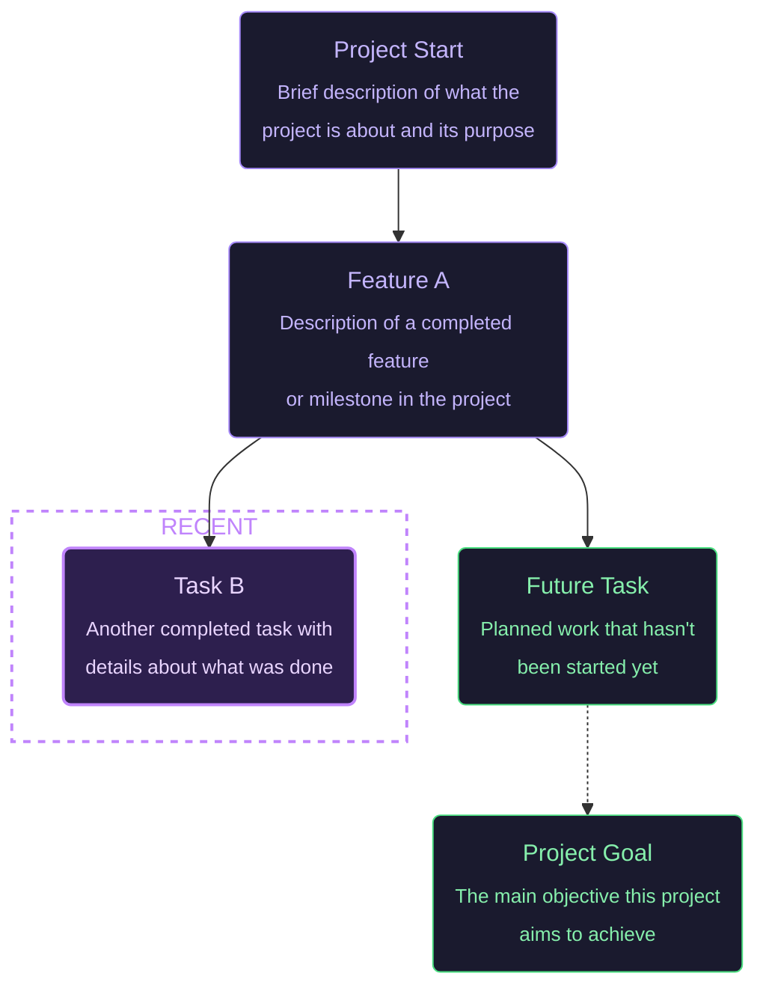

<div align="center">

<br>

# Viz-Vibe: Context Map Plugin for Vibe Coding

A graph-based navigator plugin to track your coding trajectory, issues, and TODO lists — all in one place. We make human-AI collaboration seamless by keeping coding context clear at a glance.

### 🔌 Works with your favorite vibe coding tools

**Cursor** • **Antigravity** • **VS Code** • **Claude Code** • **Open Code** • **oh-my-opencode** • **oh-my-claude** • **Codex CLI** • **Gemini CLI** • **Vibe Kanban** • and more!

<p align="center">
  <a href="#-getting-started">Getting Started</a> •
  <a href="#-ai-integration">AI Integration</a> •
  <a href="#contributing">Contributing</a>
</p>

<p align="center">
  
  
  
  
</p>

---

</div>


## 🚀 About
⚡ **You don't need to read any documentation.** Your AI handles everything — from setup to daily management. 

Just pass the message below to your AI agent.

> ```
> Set up vizvibe from https://github.com/NamHyeongKeol/viz-vibe - analyze MY project, not the example.
> ```


Whatever vibe coding tool you use, your AI will generate a `vizvibe.mmd` file in your project root. **You just review the result.**

The `vizvibe.mmd` file contains your project's graph — your trajectory, decisions, blockers, and TODOs. Your AI will manage this file alongside you, updating it as your project evolves.

**Our mission:** Make even the context file itself manageable through vibes. No manual editing, no learning curve — just seamless collaboration.

> ⚠️ **Note:** Viz Vibe does NOT visualize your repository's code structure or how your project works. Instead, it visualizes your **work trajectory** — what you've done, what's planned, your decisions, blockers, and the path of your coding journey as a graph.

---

<br>

## 🚀 Getting Started

### <span style="color: #a78bfa">For All Vibe Coders</span>

Just pass the message below to your AI agent.

> ```
> Set up vizvibe from https://github.com/NamHyeongKeol/viz-vibe - analyze MY project, not the example.
> ```

### <span style="color: #a78bfa">For Claude Code Users</span>

> **1. Install VizVibe Globally**
>
> ```bash
> curl -fsSL https://raw.githubusercontent.com/NamHyeongKeol/viz-vibe/main/claude-code/install.sh | bash
> ```
>
> <details>
> <summary>What gets installed?</summary>
>
> | Location      | Files                                                                                                                       |
> | ------------- | --------------------------------------------------------------------------------------------------------------------------- |
> | `~/.vizvibe/` | CLI (`bin/vizvibe`), browser viewer (`bin/vizvibe-server.js`), hook scripts, templates                                      |
> | `~/.claude/`  | `hooks/read-vizvibe.js`, `hooks/update-vizvibe.js`, `hooks/VIZVIBE.md`, `skills/vizvibe/SKILL.md`, `settings.json` (merged) |
>
> </details>
>
> <br>
>
> **2. Initialize in your Project**
>
> ```bash
> cd your-project
> vizvibe init
> ```
>
> <details>
> <summary>What gets created?</summary>
>
> - `vizvibe.mmd` — Your trajectory graph file
> - `.claude/hooks/` — Local hook scripts for Claude Code
> - `.claude/settings.json` — Hook configuration (merges with existing settings if present)
> - `.vizvibe-state.json` added to `.gitignore` — Runtime state (auto-generated)
>
> </details>
>
> <br>
>
> **3. View in Browser**
>
> ```bash
> vizvibe view
> ```
>
> Opens at `http://localhost:5125`. Copy the setup prompt from the overlay.
>
> **4. Start Claude Code**
>
> ```bash
> claude
> ```
>
> Paste: _"Please setup vizvibe for this project. Write the trajectory in my language."_
>
> <details>
> <summary>CLI Commands</summary>
>
> | Command             | Description                            |
> | ------------------- | -------------------------------------- |
> | `vizvibe init`      | Initialize `vizvibe.mmd`               |
> | `vizvibe view`      | Open in browser (port 5125)            |
> | `vizvibe uninstall` | Uninstall Viz Vibe and clean up config |
> | `vizvibe help`      | Show help                              |
>
> **Uninstall:**
>
> You can uninstall anytime via CLI:
>
> ```bash
> vizvibe uninstall
> ```
>
> Alternatively, use the one-liner:
>
> ```bash
> curl -fsSL https://raw.githubusercontent.com/NamHyeongKeol/viz-vibe/main/claude-code/uninstall.sh | bash
> ```
>
> </details>

<br>

### <span style="color: #a78bfa">For Cursor / Antigravity / VS Code Users</span>

> **1. Install Extension**
>
> ```bash
> Search "Viz Vibe" in the Extensions panel (`Cmd+Shift+X`) and Install Extension.
> ```
>
> <details>
> <summary>Alternative: Install from VSIX</summary>
>
> 1. Download the latest `.vsix` from [Releases](https://github.com/NamHyeongKeol/viz-vibe/releases)
> 2. `Cmd+Shift+P` → **"Extensions: Install from VSIX..."**
> 3. Select the downloaded file and reload
> </details>
>
> <br>
>
> **2. Initialize Project**
>
> ```bash
> When the "Initialize Viz Vibe?" prompt appears, click Yes.
> ```
>
> **3. Setup with AI**
>
> ```bash
> Open `vizvibe.mmd` — copy the setup prompt and ask your AI.
> ```
>
> ⚠️ **Note:** IDE-based AI assistants don't support automatic trajectory updates. When you want to update the graph, simply ask your AI: _"Please update vizvibe.mmd with what we've done."_

---

<br>

## 📁 File Format

Viz Vibe uses **Mermaid flowchart** syntax for trajectories:

> ⚠️ **For AI Assistants**: This is a FORMAT example only. Create the trajectory by analyzing the USER'S project (git history, README, conversation), NOT by copying this example.



### Node States

Every node has a state:

- <span style="color: #4ade80">[opened] — TODO: Planned but not yet started</span>
- <span style="color: #a78bfa">[closed] — DONE: Completed, blocked, or no longer needed</span>

<br>

## 🤖 AI Integration

### VIZVIBE.md — AI Instructions

The `VIZVIBE.md` file provides instructions for AI assistants on how to maintain the trajectory. It includes:

- Graph structure guidelines
- Node state management (`opened`/`closed`)
- When to add, close, or delete nodes
- Relationship modeling (dependencies vs parallel work)

See the full guide: [VIZVIBE.md](./shared/templates/VIZVIBE.md)

### How It Works

1. **AI reads** `vizvibe.mmd` to understand project context
2. **AI works** on your tasks
3. **AI updates** the trajectory with new nodes or state changes
4. **Graph UI** reflects changes in real-time (VS Code extension)

---

<br>

## 🤝 Contributing

We welcome contributions! Whether it's:

- 🐛 Bug reports
- 💡 Feature suggestions
- 📝 Documentation improvements
- 🔧 Code contributions

Please open an issue or submit a pull request.

---

<br>

## 💡 Why We Built This

As AI advances, it's becoming harder for humans to keep up with the context of their AI's work during vibe coding. The challenge is that someone — both humans and AIs — still needs to understand and manage what the AI is doing. That's why we started this project.

Additionally, summarizing your project's state as a graph perfectly solves the **context overload problem** that occurs when AI conversations grow too long. What's the best way to maintain context when starting a new conversation without copy-pasting all previous history? Just use **Viz Vibe**.

---

<br>

## 📄 License

This project is licensed under the [MIT License](LICENSE).

---

<div align="center">

<br>

**Made with ❤️ for the vibe coding community**

[GitHub](https://github.com/NamHyeongKeol/viz-vibe) · [Report Bug](https://github.com/NamHyeongKeol/viz-vibe/issues) · [Request Feature](https://github.com/NamHyeongKeol/viz-vibe/issues)

</div>
