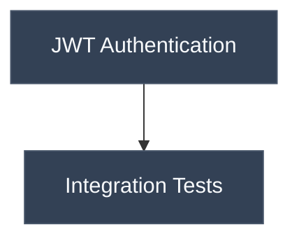

<div align="center">

# Viz-Vibe: Visual Context Map for Vibe Coding

A graph-based navigator to track your coding trajectory and maintain context across threads. We make human-AI collaboration seamless by keeping coding context clear at a glance.

<p align="center">
  <a href="#-getting-started">Getting Started</a> •
  <a href="#-features">Features</a> •
  <a href="#-installation">Installation</a> •
  <a href="#-ai-integration">AI Integration</a> •
  <a href="#contributing">Contributing</a>
</p>

<p align="center">
  
  
  
</p>

---

</div>

## 🚀 About

**Viz Vibe** is an open-source project that provides a **graph-structured workflow** as an interface for collaboration between humans and AI. By visualizing the coding process as an interactive graph, it enables intuitive and efficient "vibe coding" experiences.

> 💡 _Vibe Coding_ — A new paradigm where developers and AI work together in harmony, guided by visual workflows and intuitive interactions.

---

## 🚀 Getting Started

### For Claude Code Users

Run this one-liner in your project directory:

```bash
curl -fsSL https://raw.githubusercontent.com/NamHyeongKeol/viz-vibe/main/claude-code/install.sh | bash
```

This creates:

- `.claude/settings.json` — Claude Code settings with hooks
- `.claude/hooks/update-trajectory.js` — Auto-update script
- `trajectory.mmd` — Your work history graph (Mermaid format)
- `VIZVIBE.md` — AI instructions for trajectory management

**That's it!** Claude Code will automatically update `trajectory.mmd` after each response.

#### Other Commands

```bash
# Update hook script to latest version
curl -fsSL https://raw.githubusercontent.com/NamHyeongKeol/viz-vibe/main/claude-code/update.sh | bash

# Uninstall (keeps trajectory.mmd and VIZVIBE.md)
curl -fsSL https://raw.githubusercontent.com/NamHyeongKeol/viz-vibe/main/claude-code/uninstall.sh | bash
```

### For VS Code / Cursor / Antigravity (Windsurf) Users

1. Download the latest `.vsix` from [Releases](https://github.com/NamHyeongKeol/viz-vibe/releases)
2. `Cmd+Shift+P` → **"Extensions: Install from VSIX..."**
3. Select the downloaded file and reload
4. Run `Cmd+Shift+P` → **"Viz Vibe: Initialize Project"**
5. Open `trajectory.mmd` to see the graph visualization

---

## ✨ Features

- 🔗 **Graph-based Context** — Visualize your coding journey as interconnected nodes
- 🤝 **Human-AI Collaboration** — Track decisions, blockers, and progress together
- 📊 **Mermaid Native** — Uses standard Mermaid syntax, viewable anywhere (GitHub, Notion, etc.)
- 🔄 **Auto-Update** — Trajectory updates automatically after AI responses (Claude Code)
- 📁 **`.mmd` File Format** — Human-readable, AI-editable Mermaid flowcharts
- 🤖 **AI-Native Design** — Built for AI assistants to read and modify

---

## 📁 File Format

Viz Vibe uses **Mermaid flowchart** syntax for trajectories:



### Node States

Every node has a state:

- `[opened]` — TODO: Planned but not yet started
- `[closed]` — DONE: Completed, blocked, or no longer needed

### Node Types

| Type         | Shape       | Use Case                |
| ------------ | ----------- | ----------------------- |
| `start`      | `(["..."])` | Project/phase beginning |
| `ai-task`    | `["..."]`   | AI work, implementation |
| `human-task` | `["..."]`   | Human action/decision   |
| `condition`  | `{"..."}`   | Branch point            |
| `blocker`    | `{{"..."}}` | Dead end                |
| `end`        | `(["..."])` | Completion              |

---

## 🤖 AI Integration

### VIZVIBE.md — AI Instructions

The `VIZVIBE.md` file provides instructions for AI assistants on how to maintain the trajectory. It includes:

- Graph structure guidelines
- Node state management (`opened`/`closed`)
- When to add, close, or delete nodes
- Relationship modeling (dependencies vs parallel work)

See the full guide: [VIZVIBE.md](./VIZVIBE.md)

### How It Works

1. **AI reads** `trajectory.mmd` to understand project context
2. **AI works** on your tasks
3. **AI updates** the trajectory with new nodes or state changes
4. **Graph UI** reflects changes in real-time (VS Code extension)

---

## � Installation

### Project Structure

```
viz-vibe/
├── vscode-extension/     # VS Code, Cursor, Antigravity
│   ├── src/
│   ├── package.json
│   └── ...
│
├── claude-code/          # Claude Code
│   ├── templates/
│   ├── install.sh
│   ├── uninstall.sh
│   └── update.sh
│
├── mcp-server/           # MCP Server (optional)
│
├── VIZVIBE.md            # AI instructions (shared)
└── README.md
```

### Build VS Code Extension from Source

```bash
# Clone the repository
git clone https://github.com/NamHyeongKeol/viz-vibe.git
cd viz-vibe/vscode-extension

# Install dependencies
npm install

# Compile
npm run compile

# Package as .vsix
npx @vscode/vsce package
```

### Development

```bash
cd vscode-extension

# Watch mode
npm run watch

# Debug: Press F5 in VS Code
```

---

## 🤝 Contributing

We welcome contributions! Whether it's:

- 🐛 Bug reports
- 💡 Feature suggestions
- 📝 Documentation improvements
- 🔧 Code contributions

Please open an issue or submit a pull request.

---

## 📄 License

This project is licensed under the [MIT License](LICENSE).

---

<div align="center">

**Made with ❤️ for the vibe coding community**

[GitHub](https://github.com/NamHyeongKeol/viz-vibe) · [Report Bug](https://github.com/NamHyeongKeol/viz-vibe/issues) · [Request Feature](https://github.com/NamHyeongKeol/viz-vibe/issues)

</div>
