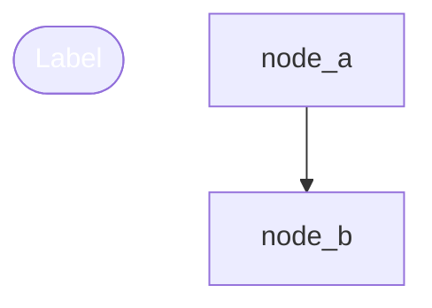

# VIZVIBE.md - Trajectory Update Instructions

This file provides instructions to AI assistants on how to update `trajectory.mmd` file.

## File Location

```
./trajectory.mmd
```

## Mermaid Format Structure

The trajectory file uses **Mermaid flowchart** syntax with metadata comments:



## Node Types and Shapes

| Type | Shape Syntax | Color | Use Case |
|------|--------------|-------|----------|
| `start` | `node(["Label"])` | Green `#22c55e` | Entry point, initial research |
| `ai-task` | `node["Label"]` | Blue `#3b82f6` | AI work, implementation |
| `condition` | `node{"Label"}` | Orange `#f59e0b` | Decision point, branching |
| `blocker` | `node{{"Label"}}` | Red `#dc2626` | Dead end, blocked path |
| `end` | `node(["Label"])` | Green `#22c55e` | Completion point |

## Node ID Convention

Use descriptive snake_case IDs with prefix:
```
node_<descriptive_name>
```

Examples:
- `node_research_start`
- `node_mermaid_migration`
- `node_deadend_no_api`

## Metadata Comment Format

Each node MUST have a metadata comment directly above it:

```mermaid
%% @node_id [type]: Short description of what this node represents
node_id["Label"]
```

- `@node_id` - Must match the node ID below
- `[type]` - One of: `start`, `ai-task`, `condition`, `blocker`, `end`
- Description - Brief explanation (one line)

## Style Definitions

Always add style definitions at the bottom:

```mermaid
%% Styles
style node_id fill:#22c55e,stroke:#16a34a,color:#fff
```

Color reference:
- Green (start/end): `fill:#22c55e,stroke:#16a34a,color:#fff`
- Blue (ai-task): `fill:#3b82f6,stroke:#2563eb,color:#fff`
- Orange (condition): `fill:#f59e0b,stroke:#d97706,color:#fff`
- Red (blocker): `fill:#dc2626,stroke:#b91c1c,color:#fff`

## AI Update Instructions

### When to Update

Update `trajectory.mmd` when you:
1. Complete a significant task or milestone
2. Encounter a blocker or dead end
3. Make an architectural decision
4. Change approach or direction

### How to Add a New Node

1. Generate a unique node ID
2. Add metadata comment with `@node_id [type]: description`
3. Add node definition with appropriate shape
4. Connect with edges from relevant existing nodes
5. Add style definition

### Example Addition

```mermaid
%% Existing content above...

%% @node_hook_implementation [ai-task]: Implemented Stop hook for automatic trajectory updates
node_hook_implementation["Stop Hook 구현"]

%% Edges (add new connection)
node_previous --> node_hook_implementation

%% Styles (add new style)
style node_hook_implementation fill:#3b82f6,stroke:#2563eb,color:#fff
```

### Important Rules

1. **Never remove existing nodes** - trajectory is a history
2. **Preserve all edges** - maintain graph connectivity
3. **Use Korean or English** - match existing style in the file
4. **Keep labels concise** - max 20 characters recommended
5. **Add blockers honestly** - dead ends are valuable information

## Current Trajectory Context

The trajectory tracks the development of **Viz Vibe** project:
- Started with research on AI auto-recording
- Explored multiple approaches (file monitoring, MCP server, export)
- Migrated from JSON to Mermaid native format
- Currently implementing automation features
