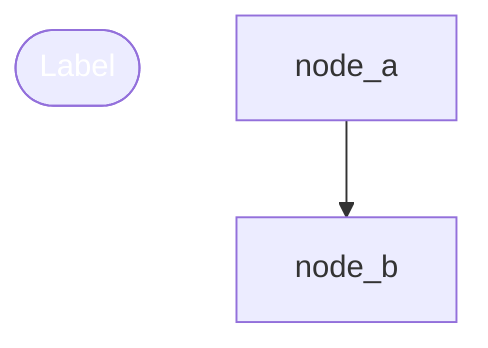

# VIZVIBE.md - Trajectory Update Instructions

This file provides instructions to AI assistants on how to update `trajectory.mmd` file.

## File Location

```
./trajectory.mmd
```

## Mermaid Format Structure

The trajectory file uses **Mermaid flowchart** syntax with metadata comments:



## Node Types and Shapes

| Type | Shape Syntax | Color | Use Case |
|------|--------------|-------|----------|
| `start` | `node(["Label"])` | Green `#10b981` | Entry point, initial research |
| `ai-task` | `node["Label"]` | Gray `#334155` | AI work, implementation |
| `condition` | `node{"Label"}` | Orange `#f59e0b` | Decision point, branching |
| `blocker` | `node{{"Label"}}` | Red `#dc2626` | Dead end, blocked path |
| `end` | `node(["Label"])` | Green `#10b981` | Completion point |

## Node ID Convention

Use descriptive snake_case IDs:
```
node_<descriptive_name>
```

Examples:
- `node_research_start`
- `node_api_implementation`
- `node_deadend_no_api`

## Metadata Comment Format

Each node MUST have a metadata comment directly above it:

```mermaid
%% @node_id [type]: Short description of what this node represents
node_id["Label"]
```

- `@node_id` - Must match the node ID below
- `[type]` - One of: `start`, `ai-task`, `condition`, `blocker`, `end`
- Description - Brief explanation (one line)

## Style Definitions

Always add style definitions at the bottom:

```mermaid
style node_id fill:#10b981,stroke:#059669,color:#fff,stroke-width:2px
```

Color reference:
- Green (start/end): `fill:#10b981,stroke:#059669,color:#fff,stroke-width:2px`
- Gray (ai-task): `fill:#334155,stroke:#475569,color:#f8fafc,stroke-width:1px`
- Orange (condition): `fill:#0f172a,stroke:#f59e0b,color:#fbbf24,stroke-width:2px`
- Red (blocker): `fill:#450a0a,stroke:#dc2626,color:#fca5a5,stroke-width:2px`

## AI Update Instructions

### When to Update

Update `trajectory.mmd` when you:
1. Complete a significant task or milestone
2. Encounter a blocker or dead end
3. Make an architectural decision
4. Change approach or direction

### How to Add a New Node

1. Generate a unique node ID
2. Add metadata comment with `@node_id [type]: description`
3. Add node definition with appropriate shape
4. Connect with edges from relevant existing nodes
5. Add style definition

### Example Addition

```mermaid
%% Existing content above...

%% @node_new_feature [ai-task]: Implemented user authentication
node_new_feature["User Auth Implementation"]

%% Edges (add new connection)
node_previous --> node_new_feature

%% Styles (add new style)
style node_new_feature fill:#334155,stroke:#475569,color:#f8fafc,stroke-width:1px
```

### Important Rules

1. **Never remove existing nodes** - trajectory is a history
2. **Preserve all edges** - maintain graph connectivity
3. **Keep labels concise** - max 20 characters recommended
4. **Add blockers honestly** - dead ends are valuable information
