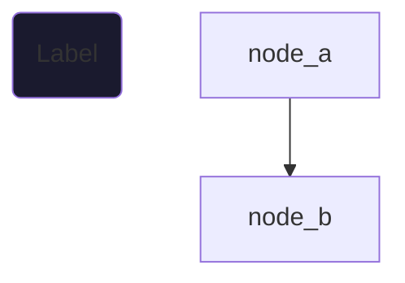

# VIZVIBE.md - Trajectory Management Guide

This document provides instructions for AI assistants on how to maintain the `vizvibe.mmd` file as a **context map** for the project.

---

## About Viz Vibe

# Viz-Vibe: Visual Context Map for Vibe Coding

**Viz Vibe** is a graph-based navigator to track your coding trajectory and maintain context across threads. We make human-AI collaboration seamless by keeping coding context clear at a glance.

### What is `vizvibe.mmd`?

The `vizvibe.mmd` file is a **Mermaid flowchart** that serves as:

- A **visual map** of the project's evolution
- A **shared context** between human and AI
- A **TODO/hypothesis tracker** in graph form
- A **memory** that persists across conversation sessions

It's not a changelog or commit log — it's a **living document** that captures the high-level journey of a project.

---

## User Context

### Who Uses Viz Vibe?

Our primary users are developers who:

- Are in the middle of **vibe coding** with an AI assistant
- Have been struggling with **context management** across sessions
- Want to visualize their coding journey without losing momentum

### Installation Scenario

Users typically install Viz Vibe **while keeping their current AI conversation session active**:

- They open a **separate terminal window** to run the install command
- Their main AI session (Cursor, Antigravity, VS Code, Claude Code, Codex CLI) continues running
- They expect the AI to immediately understand and use the trajectory

### The Critical First Draft

**Creating a good initial graph is essential.**

The **primary data source** is the user's current conversation history with their AI assistant. This reveals:

- What the user has been working on
- What decisions were made
- What's still pending
- What blockers were encountered

**AI assistants should:**

1. Thoroughly read the current conversation history
2. Extract key milestones, decisions, and pending work
3. Create a well-structured initial trajectory graph
4. Capture both completed work (`closed`) and planned work (`opened`)

### Always Review Codebase and Git History

**Even when conversation history seems sufficient**, always examine the codebase and git history to:

- **Fill gaps**: Capture work that happened before this conversation or in other sessions
- **Verify understanding**: Confirm that conversation context matches actual code state
- **Add missing context**: Include important project history not mentioned in the conversation

**What to look for:**

- **README.md (IMPORTANT!)**: Most users document their project extensively in the README. This is often the best source for understanding:

  - Project purpose and goals
  - Architecture and design decisions
  - Setup instructions and dependencies
  - Current status and roadmap

  **Always read the README first** — it's the user's curated summary of their project.

- **Git logs**: Get the big picture of recent work
  - Focus on the current branch's recent commits
  - Understand relationships with other branches
  - Don't analyze each commit in detail — understand the trajectory
- **Code structure**: Understand project organization and patterns
- **Recent changes**: Identify what's actively being developed

**Key principle**: The conversation is the starting point, but the trajectory should reflect the **full project context** — including things the user didn't explicitly mention.

### Capture the Human-AI Perspective

The trajectory should capture more than just code changes — it should reflect the **shared understanding** between the user and AI:

- **Interpretation of history**: How do we understand what was done and why?
- **Future direction**: What are the agreed-upon next steps?
- **Open questions**: What hypotheses need validation?
- **Lessons learned**: What approaches worked or didn't work?

The `.mmd` file is not just a changelog — it's a **living map of the project's context** as understood by both human and AI.

### Update Granularity

**Code changes and trajectory updates are not always coupled:**

| Scenario                                                                   | Update .mmd? |
| -------------------------------------------------------------------------- | ------------ |
| Major discussion without code changes (e.g., planning, deciding direction) | ✅ Yes       |
| Small code fix or routine refactoring                                      | ❌ No        |
| New hypothesis or approach identified                                      | ✅ Yes       |
| Bug fix that doesn't change project direction                              | ❌ No        |
| Completing a significant milestone                                         | ✅ Yes       |

Think of the trajectory as a **graph of TODOs and hypotheses**, not a log of every action. It operates at a higher level than individual code changes.

**Rule of thumb**: If it's something you'd want to remember when resuming work tomorrow, or when explaining the project to a new collaborator — it belongs in the trajectory.

---

## Key Decisions When Building the Graph

When adding information to the trajectory, two decisions are critical:

### Decision 1: Should this be a node?

Not every piece of information deserves a node. Ask:

- Is this significant enough to remember?
- Would this help understand the project's evolution?
- Is this a milestone, decision point, or learning?
- If there are two similar plans or tasks at the same level, either add both or add neither — don't create an unbalanced graph

If no — don't add it. Keep the graph focused.

### Decision 2: How should nodes be connected?

**Which node to connect to is critically important.**

Once you decide to add a node, determine:

- **Which existing node(s) should it connect to?** Choose carefully — this defines the relationship.
- **Should it connect at all?** Not all nodes need connections.
- **Parallel or sequential?**
  - **Parallel**: Independent tasks that can happen in any order
  - **Sequential**: Task B depends on Task A completing first

This is where most mistakes happen — connecting things that shouldn't be connected, or chaining independent tasks.

---

## Core Principles

### 1. Graph-Based History

Maintain the project history as a **graph structure** in `vizvibe.mmd`:

- **Doesn't have to be a tree** — cycles and multiple paths are allowed
- Captures the evolution of the project at a **high level**
- Shows decision points, experiments, and outcomes

### 2. Project Goals

The trajectory should clearly state:

- **Ultimate goal**: The final objective of the project
- **Current goal**: What we're working toward right now (if known)

Place these as prominent nodes or comments at the top of the graph.

### 3. Connecting Nodes: Parallel vs Sequential

When adding new nodes, carefully consider how they relate to existing nodes:

**Parallel connections** (branch from same parent):

- Tasks are independent and can happen in any order
- No dependency between them
- Common for "options to explore" or "alternative approaches"

**Sequential connections** (chain A → B):

- Task B depends on Task A
- B cannot start until A is done
- Represents true dependency

```mermaid
%% PARALLEL: Independent tasks branch from parent
parent --> option_a
parent --> option_b
parent --> option_c

%% SEQUENTIAL: B depends on A
task_a --> task_b --> task_c
```

**Common mistake**: Chaining tasks just because they happened in order. If there's no real dependency, they should be parallel.

**Note**: Future work is often parallel (multiple things to try), but can be sequential if there's a clear dependency chain.

### 4. Only Important Context

**DO NOT** add every small task to the trajectory:

- ✅ Major milestones and decisions
- ✅ Architectural changes
- ✅ Dead ends and blockers (valuable learnings)
- ✅ Branch points with multiple approaches
- ❌ Trivial fixes
- ❌ Minor refactoring
- ❌ Routine tasks

---

## Node States: `[opened]` vs `[closed]`

Every node must have a state indicated in its metadata comment:

```mermaid
%% @node_id [ai-task, opened]: Task we plan to do
%% @node_id [ai-task, closed]: Task we completed or abandoned
```

### `[opened]` — TODO

- Task is planned but **not yet started**
- Represents future work worth tracking
- May have uncertainty about approach

### `[closed]` — DONE (success or failure)

A node is closed when:

- ✅ **Successfully completed** — achieved its goal
- ❌ **Dead end** — tried but hit limitations (use `blocker` type)
- ⏭️ **No longer needed** — situation changed, task became irrelevant

### State Transitions

| Scenario                     | Action                                                                       |
| ---------------------------- | ---------------------------------------------------------------------------- |
| Completed successfully       | Change to `[closed]`                                                         |
| Tried but failed/blocked     | Change to `[closed]`, use `blocker` type                                     |
| No longer needed (important) | Change to `[closed]`, optionally connect from the node that made it obsolete |
| No longer needed (trivial)   | **Delete the node**                                                          |
| Retrospectively trivial      | **Delete the node**                                                          |

---

## Managing the Graph

### Restructuring the Graph

If the existing `vizvibe.mmd` seems **incorrectly structured** based on your new understanding of the project:

- You **may restructure** the graph to better reflect the actual context
- Reorganize nodes and edges to show the true relationships
- This is not "rewriting history" — it's correcting a previously inaccurate map

Common reasons to restructure:

- Nodes were connected that shouldn't be (false dependencies)
- Parallel work was incorrectly shown as sequential
- The graph doesn't match the actual project evolution
- Key context was missing or misrepresented

### Proactively Suggest Corrections

When new information causes a **reinterpretation** of past history or future plans:

- The entire map may need to be restructured
- **Don't wait for the user to ask** — proactively suggest corrections
- Explain what changed and why the current structure is inaccurate
- Propose a revised structure that reflects the new understanding

This is especially important when:

- A major assumption turns out to be wrong
- The project direction fundamentally shifts
- Previously separate efforts are now understood to be connected (or vice versa)

### Adding Nodes

Add a node when:

- You complete significant work worth remembering
- You discover a new approach to explore
- You hit a dead end (valuable for future context!)
- You identify future work from the current conversation

### Removing Nodes

Remove a node when:

- It was added by mistake
- It turned out to be trivial in hindsight
- It clutters the graph without adding context

> **Note**: This is different from closing a node. Closed nodes remain as history. Deleted nodes are gone.

### Updating Connections

When new information changes the graph:

- Add edges from nodes that enable or invalidate other nodes
- Remove edges that no longer represent real dependencies
- Cycles are allowed if they represent iterative refinement

---

## Real-World Example

Here's a complete example of a `vizvibe.mmd` file from the Viz Vibe project itself:

```mermaid
flowchart TD
    %% === PROJECT GOALS ===
    %% Ultimate Goal: Make human-AI collaboration seamless with visual context maps
    %% Current Goal: Expand AI agent integrations to other platforms
    %% @lastActive: design_renewal

    %% === START ===
    %% @project_start [start, closed]: Project started - graph-based context management tool
    project_start("Viz Vibe Project Start<br/><sub>Graph-based context management</sub>")

    %% @ultimate_goal [end, opened]: Ultimate goal - visualize context across all AI coding environments
    ultimate_goal("Solve Context Problem<br/><sub>Visualize context, persist memory across sessions</sub>")

    %% === COMPLETED WORK ===
    %% @mermaid_native [ai-task, closed]: Switched from JSON to Mermaid .mmd
    mermaid_native("Mermaid Native Format<br/><sub>JSON → .mmd, renders anywhere</sub>")

    %% @claude_code_integration [ai-task, closed]: Claude Code AI agent integration via hooks
    claude_code_integration("Claude Code Integration<br/><sub>Hook-based automation</sub>")

    %% @vizvibe_guide [ai-task, closed]: Created VIZVIBE.md guide
    vizvibe_guide("VIZVIBE.md Guide<br/><sub>AI trajectory management guide</sub>")

    %% @install_scripts [ai-task, closed]: Created install scripts
    install_scripts("CLI Install Scripts<br/><sub>curl one-liner install/uninstall</sub>")

    %% @vscode_extension [ai-task, closed]: VS Code extension with graph visualization and node copy
    vscode_extension("VS Code Extension<br/><sub>Graph visualization + node copy</sub>")

    %% @lastactive_tracking [ai-task, closed]: Added lastActiveNode tracking to state.json and hooks
    lastactive_tracking("Last Active Tracking<br/><sub>state.json + hooks update</sub>")

    %% @design_renewal [ai-task, closed]: GitHub-style design - green/purple colors, rounded rectangles
    design_renewal("Design Renewal<br/><sub>GitHub-style colors, rounded nodes</sub>")

    %% === FUTURE WORK: AI AGENT INTEGRATIONS ===
    %% @vscode_agent_integration [ai-task, opened]: VS Code AI agent integration
    vscode_agent_integration("VS Code AI Integration<br/><sub>Copilot and other AI extensions</sub>")

    %% @cursor_agent_integration [ai-task, opened]: Cursor AI agent integration
    cursor_agent_integration("Cursor AI Integration<br/><sub>Rules-based approach</sub>")

    %% @antigravity_agent_integration [ai-task, opened]: Antigravity AI agent integration
    antigravity_agent_integration("Antigravity AI Integration<br/><sub>Shortcut + gemini.md approach</sub>")

    %% @antigravity_hook_support [ai-task, opened]: Antigravity hook support when available
    antigravity_hook_support("Antigravity Hook Support<br/><sub>Apply hook automation when available</sub>")

    %% @codex_cli_integration [ai-task, opened]: Codex CLI AI agent integration
    codex_cli_integration("Codex CLI Integration<br/><sub>Hook-based integration</sub>")

    %% === FUTURE WORK: OTHER ===
    %% @lib_packaging [ai-task, opened]: Library packaging - SDK for Python, Java, JS
    lib_packaging("Library Packaging<br/><sub>Python, Java, JS SDK</sub>")

    %% @mcp_server [ai-task, opened]: Complete MCP server
    mcp_server("MCP Server<br/><sub>Universal AI client support</sub>")

    %% === CONNECTIONS ===
    project_start --> mermaid_native
    mermaid_native --> claude_code_integration
    mermaid_native --> vscode_extension
    claude_code_integration --> vizvibe_guide
    claude_code_integration --> install_scripts
    claude_code_integration --> lib_packaging
    claude_code_integration --> codex_cli_integration
    vscode_extension --> lastactive_tracking
    lastactive_tracking --> design_renewal
    vscode_extension --> vscode_agent_integration
    vscode_extension --> cursor_agent_integration
    vscode_extension --> antigravity_agent_integration
    antigravity_agent_integration --> antigravity_hook_support
    mermaid_native --> mcp_server
    lib_packaging -.-> ultimate_goal
    mcp_server -.-> ultimate_goal
    codex_cli_integration -.-> ultimate_goal
    vscode_agent_integration -.-> ultimate_goal
    cursor_agent_integration -.-> ultimate_goal
    antigravity_hook_support -.-> ultimate_goal

    %% === STYLES ===
    %% GitHub-inspired colors: Open = green, Closed = purple/gray

    %% Start node (teal)
    style project_start fill:#1a1a2e,stroke:#2dd4bf,color:#5eead4,stroke-width:2px

    %% Ultimate Goal (muted)
    style ultimate_goal fill:#1a1a2e,stroke:#6b7280,color:#9ca3af,stroke-width:1px

    %% Closed tasks (soft purple - like GitHub merged)
    style mermaid_native fill:#1a1a2e,stroke:#a78bfa,color:#c4b5fd,stroke-width:1px
    style claude_code_integration fill:#1a1a2e,stroke:#a78bfa,color:#c4b5fd,stroke-width:1px
    style vizvibe_guide fill:#1a1a2e,stroke:#a78bfa,color:#c4b5fd,stroke-width:1px
    style install_scripts fill:#1a1a2e,stroke:#a78bfa,color:#c4b5fd,stroke-width:1px
    style vscode_extension fill:#1a1a2e,stroke:#a78bfa,color:#c4b5fd,stroke-width:1px
    style lastactive_tracking fill:#1a1a2e,stroke:#a78bfa,color:#c4b5fd,stroke-width:1px

    %% Last active node (highlighted - brighter purple)
    style design_renewal fill:#2d1f4e,stroke:#c084fc,color:#e9d5ff,stroke-width:2px

    %% Open tasks (soft green - like GitHub open)
    style vscode_agent_integration fill:#1a1a2e,stroke:#4ade80,color:#86efac,stroke-width:1px
    style cursor_agent_integration fill:#1a1a2e,stroke:#4ade80,color:#86efac,stroke-width:1px
    style antigravity_agent_integration fill:#1a1a2e,stroke:#4ade80,color:#86efac,stroke-width:1px
    style antigravity_hook_support fill:#1a1a2e,stroke:#4ade80,color:#86efac,stroke-width:1px
    style codex_cli_integration fill:#1a1a2e,stroke:#4ade80,color:#86efac,stroke-width:1px
    style lib_packaging fill:#1a1a2e,stroke:#4ade80,color:#86efac,stroke-width:1px
    style mcp_server fill:#1a1a2e,stroke:#4ade80,color:#86efac,stroke-width:1px
```



### Key Patterns in This Example

1. **Start & Goal nodes**: Project start (teal) and ultimate goal (gray) frame the trajectory
2. **Title + Description format**: `("Title<br/><sub>Description</sub>")` — Shows both what and why
3. **Clear separation**: Completed work (closed) vs Future work (opened)
4. **@lastActive marker**: `design_renewal` is marked as last active with highlighted purple style
5. **Parallel branches from same parent**:
   - `claude_code_integration` → `lib_packaging`, `codex_cli_integration` (independent CLI integrations)
   - `vscode_extension` → `vscode_agent_integration`, `cursor_agent_integration` (IDE-related work)
6. **Dashed lines to ultimate goal (-.->)**: Shows what needs to be done but not yet achieved
7. **GitHub-inspired colors**: Green border = open, Purple border = closed, Bright purple = last active

---

## File Format

### Structure



### Last Active Node Tracking

**Important**: Always update the `%% @lastActive: node_id` line when you work on a node.

This marker:
- Shows which node was most recently worked on
- Gets highlighted with a brighter style in the graph
- Helps users see at a glance what was last touched

### Node Shape

Use rounded rectangles `("...")` for all nodes. This creates a clean, uniform look:

```mermaid
node_id("Node Label")
```

### Node Types (in metadata only)

| Type         | Use Case                |
| ------------ | ----------------------- |
| `start`      | Project/phase beginning |
| `ai-task`    | AI work, implementation |
| `human-task` | Human decision/action   |
| `condition`  | Decision point, branch  |
| `blocker`    | Dead end, blocked path  |
| `end`        | Completion point        |

### Style Reference (GitHub-inspired)

All nodes use dark background with colored borders:

```mermaid
%% Start node (teal)
style node fill:#1a1a2e,stroke:#2dd4bf,color:#5eead4,stroke-width:2px

%% Closed tasks (soft purple - like GitHub merged)
style node fill:#1a1a2e,stroke:#a78bfa,color:#c4b5fd,stroke-width:1px

%% Open tasks (soft green - like GitHub open)
style node fill:#1a1a2e,stroke:#4ade80,color:#86efac,stroke-width:1px

%% Last active node (highlighted purple)
style node fill:#2d1f4e,stroke:#c084fc,color:#e9d5ff,stroke-width:2px

%% Blocker (soft red)
style node fill:#1a1a2e,stroke:#f87171,color:#fca5a5,stroke-width:1px

%% End/Goal (muted gray)
style node fill:#1a1a2e,stroke:#6b7280,color:#9ca3af,stroke-width:1px
```

**Color meanings:**
- **Green border**: Open/TODO tasks
- **Purple border**: Closed/Done tasks
- **Bright purple (highlighted)**: Last active node
- **Teal border**: Start node
- **Gray border**: End/Goal node
- **Red border**: Blocker

---

## AI Instructions Summary

1. **Read** `vizvibe.mmd` at the start of each session to understand context
2. **Update** after completing significant work
3. **Update `@lastActive`** — always set `%% @lastActive: node_id` to the node you just worked on
4. **Add future work** identified during the session as `[opened]` nodes
5. **Close nodes** when work is done or no longer relevant
6. **Delete nodes** that are trivial or mistaken
7. **Maintain relationships** — connect dependent tasks, keep independent tasks parallel
8. **Keep it high-level** — this is a map, not a changelog
9. **Use consistent styling** — GitHub-inspired colors (green=open, purple=closed)
